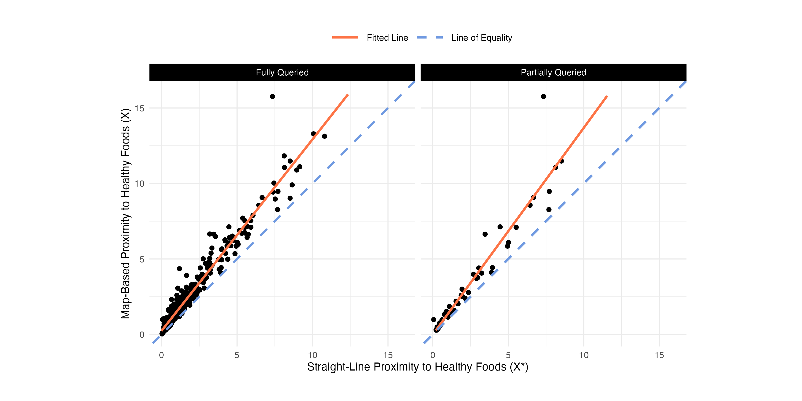

# Combining straight-line and map-based distances to investigate the connection between proximity to healthy foods and disease

This repository contains `R` code and simulation data to reproduce results from the manuscript by [Lotspeich, Mullan, D'Agostino McGowan, and Hepler (2024+)](https://arxiv.org/abs/2405.16385). 

These simulations rely on the `possum` package, which implements the multiple imputation approach for covariate measurement error in Poisson regression from the paper. The package can be found in its own repo [here](https://github.com/sarahlotspeich/possum) and installed in `R` as follows:

``` r
# Run once
# install.packages("devtools")
devtools::install_github("sarahlotspeich/possum", ref = "main")
```

## Primary Data Source (Analysis)

**1.  Merged Analytical Dataset** created using the **Healthy Food Store Locations**, **Disease Prevalence by Neighborhood (Census Tract)**, **Neighborhood (Census Tract) Population Centers**, and **Rural-Urban Commuting Area (RUCA) Codes**. 

  - [Script (Calculate Proximity)](piedmont-triad-data/raw_proximity_healthy_foods.R)
  - *Note:* A small number of census tract population centers could not be geocoded based on the original address. They were manually reviewed and assigned the nearest address that *would* geocode, and then their proximity to healthy foods was recalculated. See the [raw data](piedmont-triad-data/raw_proximity_healthy_foods.csv) and [script](piedmont-triad-data/review_proximity_healthy_foods.R) for more details. 
  - [Data (Proximity)](piedmont-triad-data/review_proximity_healthy_foods.csv)
  - [Data (Food Access + Health + RUCA)](piedmont-triad-data/analysis_data.csv)

**2.  Healthy Foods Store Locations** taken from the United States Department of Agriculture’s (UDSA’s) Historical Supplemental Nutrition Assistance Program (SNAP) Retail Locator Data (2022 Release).

  - [Download Data](https://www.fns.usda.gov/snap/retailer-locator)
  - [Script (Filter Data)](forsyth-data/healthy_foods_stores_2022.R)
  - [Data (Filtered Data)](forsyth-data/healthy_foods_stores_2022.csv)

**3.  Disease Prevalence by Neighborhood (Census Tract)** taken from the United States Centers for Disease Control and Prevention (CDC’s) PLACES Dataset (2022 Release). 

  - [Download Data](https://data.cdc.gov/500-Cities-Places/PLACES-Census-Tract-Data-GIS-Friendly-Format-2022-/shc3-fzig/data)
  - [Script (Filter Data)](piedmont-triad-data/disease_prevalences_2022.R)
  - [Data (Filtered Data)](piedmont-triad-data/disease_prevalences_2022.csv)

**4.  Neighborhood (Census Tract) Population Centers** taken from the United States Census Bureau (2010 Release). 

  - [Download Data](https://www2.census.gov/geo/docs/reference/cenpop2010/tract/CenPop2010_Mean_TR37.txt)

**5.  Rural-Urban Commuting Areas (RUCA)** taken from the United States Department of Agriculture (2010 Release).

  -  [Download Data](https://www.ers.usda.gov/data-products/rural-urban-commuting-area-codes/documentation/)

## Secondary Data Sources (Descriptive)

**6.  American Community Survey (ACS)** taken from the United States Census Bureau (2015 Release). Data were extracted using the [`tidycensus`](https://walker-data.com/tidycensus/) package. 

  - [Script (Build Data)](piedmont-triad-data/piedmont_triad_acs_data.R)
  - [Data](piedmont-triad-data/piedmont_triad_acs_data.csv)

## Tables 

**Table 1.** Simulation results under increasing severity of errors in straight-line proximity to healthy foods, as controlled by the error standard deviation $\sigma_U$.

  - [Script (Run Simulations Locally)](sims-scripts/sims_vary_sigmaU.R)
  - [Script (Make Table)](table-scripts/table1_vary_sigmaU.R)
  - [Data (Simulation Results)](sims-data/vary_sigmaU_sims_combined.csv)

**Table 2.** Simulation results under increasing proportion of neighborhoods queried to obtain map-based proximity to healthy foods, as controlled by $p_V$.

  - [Script (Run Simulations Locally)](sims-scripts/sims_vary_pV.R)
  - [Script (Make Table)](table-scripts/table2_vary_pV.R)
  - [Data (Simulation Results)](sims-data/vary_pV_sims_combined.csv)

**Table 3.** Simulation results under higher disease prevalence and prevalence ratios for map-based proximity to healthy foods, as controlled by the coefficients $\beta_0$ and $\beta_1$, respectively.

  - [Script (Run Simulations Locally)](sims-scripts/sims_vary_prev.R)
  - [Script (Make Table)](table-scripts/table3_vary_prev.R)
  - [Data (Simulation Results)](sims-data/vary_prev_sims_combined.csv)

**Table 4.** Simulation results under increasingly severe multiplicative errors in straight-line proximity to healthy foods, as controlled by the max of the error distribution $\tau_W$. 

  - [Script (Run Simulations Locally)](sims-scripts/sims_mult_error.R)
  - [Script (Make Table)](table-scripts/table4_mult_error.R)
  - [Data (Simulation Results)](sims-data/mult_error_sims_combined.csv)

**Table S1.** Simulation results under varied additive errors in straight-line proximity to healthy foods, as controlled by the mean $\mu_U$ of the errors $U$. The standard deviation $\sigma_U = 0.8$ of the errors was fixed.

  - [Script (Run Simulations Locally)](sims-scripts/sims_vary_muU.R)
  - [Script (Make Table)](table-scripts/tableS1_vary_muU.R)
  - [Data (Simulation Results)](sims-data/vary_muU/)

**Table S2.** Simulation results under varied multiplicative errors in straight-line proximity to healthy foods, as controlled by the mean $\mu_W$ of the errors $W$. The standard deviation $\sigma_W = 0.15$ of the errors was fixed.

  - [Script (Run Simulations Locally)](sims-scripts/sims_mult_error2.R)
  - [Script (Make Table)](table-scripts/tableS2_mult_errors2.R)
  - [Data (Simulation Results)](sims-data/mult_error2/)

**Table S3.** Descriptive statistics of the $N = 387$ census tracts in the Piedmont Triad, North Carolina.

  - [Script (Make Table)](table-scripts/tableS3_piedmont.R)
  - [Data (Food Access + Health + RUCA)](piedmont-triad-data/analysis_data.csv)

**Table S4.** Simulation results for the mixed-effects model under additive errors in straight-line proximity to healthy foods, with fixed $\mu_U = -0.7$ and $\sigma_U = 0.8$, and different amounts of variability in the spatial random effect, as controlled by $\tau^2$. 

  - [Script (Run Simulations Locally)](sims-scripts/sims_spatial.R)
  - [Script (Make Table)](table-scripts/tableS4_spatial_vary_tau2.R)
  - [Data (Simulation Results)](sims-data/spatial/)

## Figures 


  - [Data (Food Access + Health + RUCA)](piedmont-triad-data/analysis_data.csv)
  - [Script (Make Figure)](figure-scripts/fig1_map_piedmont_proximity.R)


  - [Data (PLACES)](piedmont-triad-data/disease_prevalences_2022.csv)
  - [Script (Make Figure)](figure-scripts/fig2_map_piedmont_triad_health_outcomes.R)



  - [Data (Food Access + Health + RUCA)](piedmont-triad-data/analysis_data.csv)
  - [Script (Make Figure)](figure-scripts/fig3_scatterplot_proximity_piedmont.R)

![stimated prevalence ratios (with 95\% confidence intervals) for proximity to healthy foods, \sclc{metropolitan status, and their interaction with the two} health outcomes in the Piedmont Triad, North Carolina using four different analysis methods. Within each health outcome and method, estimates on the right with the dashed error bars came from the mixed effects model allowing for spatial autocorrelation between neighboring census tracts; estimates on the left with the solid error bars came from the non-spatial model assuming independence between tracts.](figures/fig4_forest_plot_piedmont.png)

  - [Data (Food Access + Health + RUCA)](piedmont-triad-data/analysis_data.csv)
  - [Data (Fitted Models)](piedmont-triad-data/forest_plot_data.csv) 
  - [Script (Make Figure)](figure-scripts/fig4_forest_plot_piedmont.R)


  - [Script (Make Figure)](figure-scripts/figS1_map_comparing_distances.R)

 

  - [Data (Food Access + Health + RUCA)](piedmont-triad-data/analysis_data.csv)
  - [Script (Make Figure)](figure-scripts/figS2_cum_comp_time_line.R)

 

  - [Script (Run Simulations Locally)](sims-scripts/sims_incl_outcome.R)
  - [Data (Simulation Results)](sims-data/include_outcome/)
  - [Script (Make Figure)](figure-scripts/figS3_inclY_in_imputation_model.R)


  - [Script (Make Figure)](figure-scripts/figS4_map_piedmont_triad.R)


  - [Data (RUCA)](piedmont-triad-data/ruca2010revised.csv)
  - [Data (ACS)](piedmont-triad-data/piedmont_triad_acs_data.csv)
  - [Script (Make Figure)](figure-scripts/figS5_map_piedmont_triad_acs_data.R)


  - [Data (ACS)](piedmont-triad-data/piedmont_triad_acs_data.csv)
  - [Script (Make Figure)](figure-scripts/figS6_map_piedmont_triad_acs_race_data.R)


  - [Data (SNAP)](piedmont-triad-data/healthy_foods_stores_2022.csv)
  - [Script (Make Figure)](figures/figS7_map_SNAP.R)

 

  - [Data (Food Access + Health + RUCA)](piedmont-triad-data/analysis_data.csv)
  - [Script (Make Figure)](figure-scripts/figS8_map_piedmont_queried.R)


  - [Data (PLACES)](piedmont-triad-data/disease_prevalences_2022.csv)
  - [Script (Make Figure)](figure-scripts/figS7_map_forsyth_guilford_health_outcomes.R)


  - [Data (Food Access + Health + RUCA)](piedmont-triad-data/analysis_data.csv)
  - [Script (Make Figure)](figure-scripts/figS10_histogram_errors_proximity.R)

![**Figure S11.** Scatter plot of straight-line versus map-based proximity to healthy food store for neighborhoods (census tracts) in the Piedmont Triad, North Carolina using the fully queried data ($N = 387$) or the partially queried data ($n = 48$). The top row is among only metropolitan census tracts, and the bottom row is only among non-metropolitan census tracts. The solid line follows the fitted least-squares linear regression fit between $X$ and $X^*$ among those tracts, while the dashed line denotes the hypothetical $X = X^*$ if there had been no errors in $X^*$.](figS11_scatterplot_proximity_piedmont_metro.)

  - [Data (Food Access + Health + RUCA)](piedmont-triad-data/analysis_data.csv)
  - [Script (Make Figure)](figure-scripts/figS11_scatterplot_proximity_piedmont_metro.R)


  - [Data (Food Access + Health)](piedmont-triad-data/analysis_data.csv)
  - [Data (Fitted Models)](piedmont-triad-data/forest_plot_data.csv) 
  - [Script (Make Figure)](figure-scripts/figS12_forest_plot_intercept_piedmont.R)
